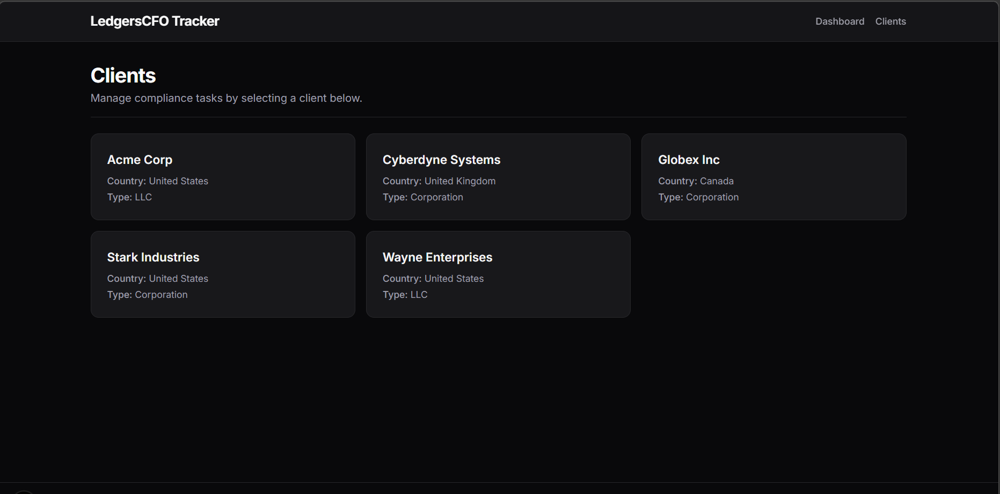

# LedgersCFO Mini Compliance Tracker



A clean, responsive, and mobile-friendly compliance task tracking application designed for LedgersCFO to manage compliance schedules for various clients.

## Features Built

- **Dashboard**: High-level overview of total clients, tasks, and overdue items.
- **Client List**: Browse all registered clients with their metadata (Entity Type, Country).
- **Client Task View**: Dive into a specific client to manage their tasks.
- **Task Management**:
  - Add new compliance tasks (`category`, `priority`, `due_date`, etc.)
  - Instantly toggle task `status` between 'Pending' and 'Completed'.
  - Filter tasks dynamically by Status & Category.
  - **Smart Overdue Highlighting**: Tasks that are 'Pending' and past their due date automatically turn red and get a prominent `OVERDUE` badge.
- **Bonus Features Delivered**:
  - Summary stats dynamically calculated on the dashboard and per-client view.
  - Highly optimized Mobile UI/UX with smooth CSS transitions without heavy JS dependency.
  - Seed script included to generate mock data.

## Technology Stack

- **Framework**: Next.js 14+ App Router
- **Styling**: Tailwind CSS v4 (Mobile-First, Dark Mode supported)
- **Database**: MongoDB (via Mongoose ORM)
- **Icons**: Lucide React
- **Date Parsing**: Date-fns

## Setup Instructions

1. **Clone the repository:**
   ```bash
   git clone <your-repo-url>
   cd mini-compliance-tracker
   ```

2. **Install dependencies:**
   ```bash
   npm install
   ```

3. **Set up environment variables:**
   Create a `.env.local` file in the root directory and add your MongoDB connection string:
   ```env
   MONGODB_URI=mongodb+srv://<username>:<password>@cluster.mongodb.net/compliance_tracker?retryWrites=true&w=majority
   ```

4. **(Optional) Seed the database:**
   If you want to start with sample clients and tasks, run the seed script:
   ```bash
   node seed.mjs
   ```
   *(Note: Ensure you have "type": "module" enabled in package.json or run it using modern Node.js)*

5. **Start the development server:**
   ```bash
   npm run dev
   ```
   Open `http://localhost:3000` to view the app in your browser!

## Tradeoffs & Assumptions

### Assumptions
- **Authentication**: Assumed out of scope for a "simple end-to-end working product." The app acts as an internal tool where any logged-in team member can view/edit task statuses.
- **Pagination**: Assumed the client list and task lists wouldn't exceed hundreds of items initially, so standard array rendering with client-side filters was used instead of complex server-side cursored pagination.
- **Task Deletion**: The requirements only asked to "Add" and "Update status". I assumed task deletion and editing other fields were not strictly required for the MVP to prioritize speed.

### Tradeoffs
- **State Management**: Opted for built-in React State (`useState`) for filtering and optimistic UI updates rather than adopting a heavy global state manager (like Redux or Zustand) to keep the architecture clean and simple.
- **Database Choice**: Chose NoSQL (MongoDB) paired with Mongoose for rapid schema iteration and flexible nested documents, instead of setting up rigorous migrations required by Prisma/PostgreSQL for a small assignment.
- **Date Handling**: Chose `date-fns` over `moment.js` because it's significantly lighter and modular, ensuring faster bundle times in Next.js.
